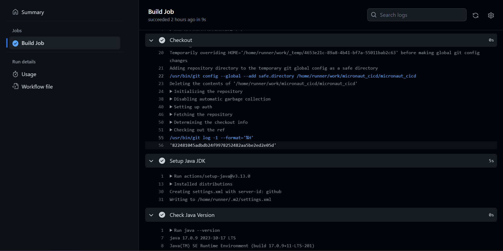
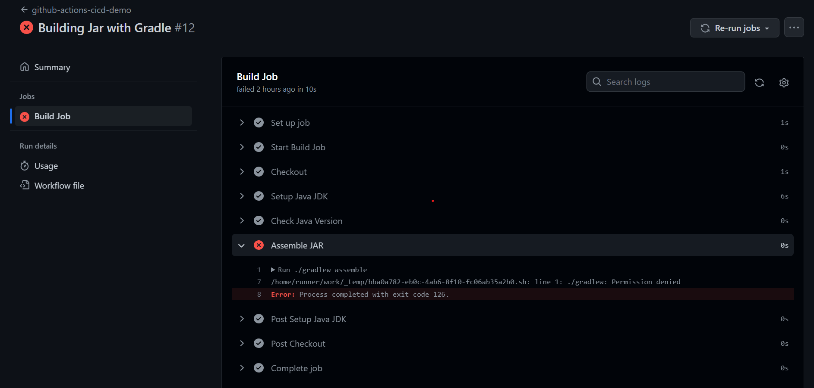
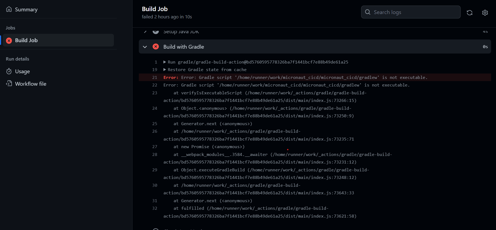
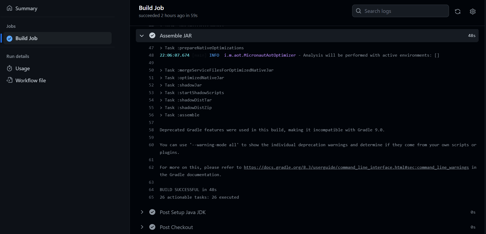
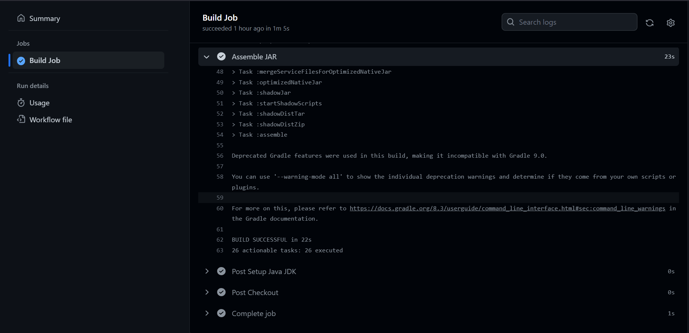
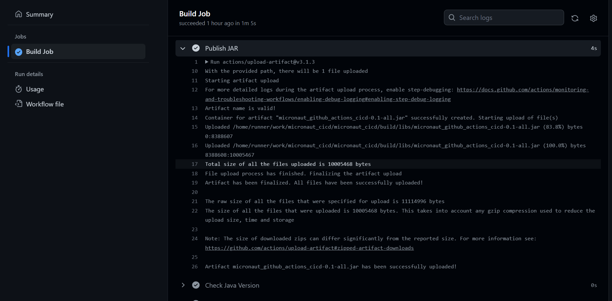
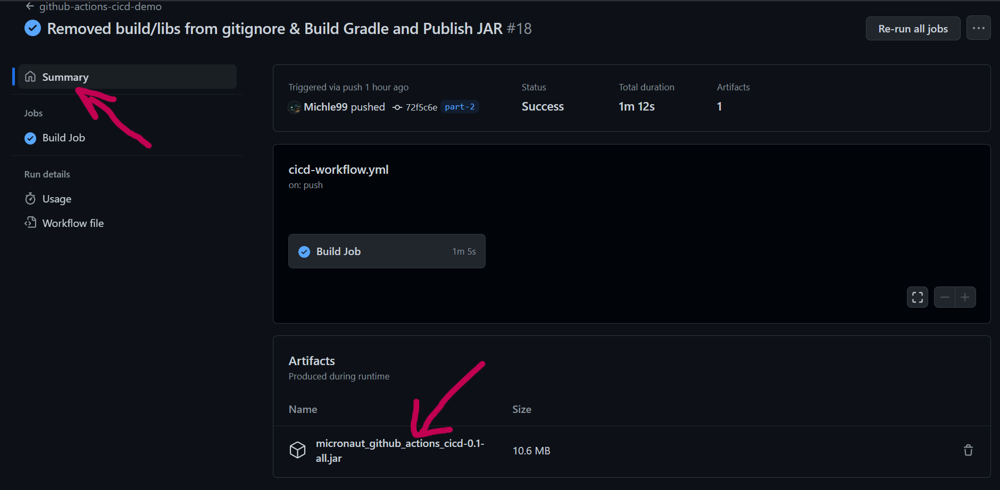
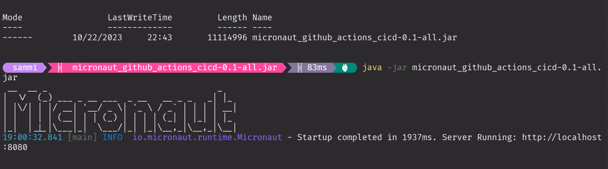

## Introduction to Micronaut and Github Actions CICD

[](https://github.com/Michle99/micronaut_cicd/actions/workflows/cicd-workflow.yml)

## Table of Contents
1. [Description](#description)
2. [Getting Started](#getting-started)
3. [Intro to Actions](#intro-to-actions)
    1. [Checkout Action](#checkout-action)
    2. [Setup Java](#setup-java)
    3. [Progress Check](#progress-check)
    4. [Progress Check Screenshot](#progress-check-screenshot)
4. [Building the JAR](#building-the-jar)
    1. [Build the JAR Error](#build-the-jar-error)
    2. [Build JAR Error Screenshot](#build-jar-error-solution)
    3. [Build JAR Error Solution](#build-jar-error-solution)
5. [Publishing the JAR](#publishing-the-jar)
6. [Build and Publish JAR Screenshots](#build-and-publish-jar-screenshots)
7. [Download the JAR file](#download-the-jar-file)
8. [Run Downloaded JAR file](#run-downloaded-jar-file)
9. [Tutorial Resources](#tutorial-resources)
10. [Micronaut Resources](#micronaut-resources)

## Description

Create a simple micronaut project and github actions workflow. Built and publish a JAR file, and tested the downloaded JAR by running the JAR file.

## Getting Started

Create a Micronaut poject using the Micronaut Launch tool to generate your project:
[Micronaut Launch tool](https://micronaut.io/launch)

## Intro to Actions

Continuing from the Creating a Github Action, the next step is to build and publish a JAR using Github actions.

Carry out the following steps:
To use an action, visit the action’s page in the marketplace and click “Use latest version” (or choose a specific version).

#### Checkout Action
- Visit the github actions marketplace, get the `checkout` action. click “Use latest version”.
- The below YAML is generated:
```
- name: 'Checkout'
  uses: actions/checkout@v4.1.1
```

#### Setup Java
- From the same marketplace, search for `setup-java-jdk`, and choose `Setup Java JDK` and get the necessary YAML below.

```
 - name: 'Setup Java JDK'
   uses: actions/setup-java@v3.13.0
   with:
     distribution: 'oracle'
     java-version: '17'

```
- Check the Java version. Setup Java JDK supported versions: 8, 11, 16, 17.

```
- name: 'Check Java Version'
  run: |
    java --version
```
 #### Progress Check

```
git add . && git commit -m "Checkout code and Setup Java 17" && git push -u origin part-2
```
#### Progress Check Screenshot


## Building the JAR
Gradle comes pre-installed in the Github runner VM, so we can simply add a step to invoke the *assemble* task with Gradle, and the JAR will be available in our workspace once it’s complete:

```
- name: 'Assemble JAR'
  run: |
    ./gradlew assemble
```
#### Build the JAR Error
While building the JAR file using the `./gradlew assemble`, the below error was encountered.

#### Build JAR Error Screenshot





#### Build JAR Error Solution
The error occurs because the `./gradlew` is not an executable file. So, change the `./gradlew` to an executable file using the below command in a git bash window.

```
git update-index --chmod=+x gradlew
```



## Publishing the JAR
So, the first build artifact is completed! Problem is once the job is complete, if we did nothing else, we would lose our JAR. It would simply go away since it’s stored in the ephemeral storage on the runner VM. So we need to do something with the JAR after we build it.
To avoid this, simply “publish” the artifact, which is another way of saying “make the JAR available for download after the runner VM has terminated.”

Carry out the following steps:
- Step to get the current version number to the JAR filename:

```
- name: 'Get Version Number'
  run: |
    echo "VERSION=$(./gradlew properties -q | grep "version:" | 
    awk '{print $2}')" >> $GITHUB_ENV
```
 - Step to publish the JAR:

 ```
 - name: 'Publish JAR'
   uses: actions/upload-artifact@v3.1.3
   with:
     name: 'micronaut_github_actions_cicd-${{env.VERSION}}-all.jar'
     path: build/libs/*-all.jar
 ```

- Commit and push changes to remote repo:
```
git add . && git commit -m “Build & Publish JAR" && git
push -u origin part-2
```
This result in the JAR being built and artifact being published and ready to be downloaded.

## Build and Publish JAR Screenshots





## Download the JAR file
To download the JAR file, select *Summary* and download the file.



## Run Downloaded JAR file
Download, unzip, and run the JAR file, and the application will start up.



## Tutorial Resources
The above project was developed using the resources below:
[Introducing Micronaut by Todd Raymond Sharp](https://www.amazon.com/Introducing-Micronaut-Deploy-Microservices-Oracle/dp/1484282892).

## Micronaut Resources

- [User Guide](https://docs.micronaut.io/4.1.5/guide/index.html)
- [API Reference](https://docs.micronaut.io/4.1.5/api/index.html)
- [Configuration Reference](https://docs.micronaut.io/4.1.5/guide/configurationreference.html)
- [Micronaut Guides](https://guides.micronaut.io/index.html)

---

- [Shadow Gradle Plugin](https://plugins.gradle.org/plugin/com.github.johnrengelman.shadow)
- [Micronaut Gradle Plugin documentation](https://micronaut-projects.github.io/micronaut-gradle-plugin/latest/)
- [GraalVM Gradle Plugin documentation](https://graalvm.github.io/native-build-tools/latest/gradle-plugin.html)

#### Feature serialization-jackson documentation

- [Micronaut Serialization Jackson Core documentation](https://micronaut-projects.github.io/micronaut-serialization/latest/guide/)

#### Feature micronaut-aot documentation

- [Micronaut AOT documentation](https://micronaut-projects.github.io/micronaut-aot/latest/guide/)
