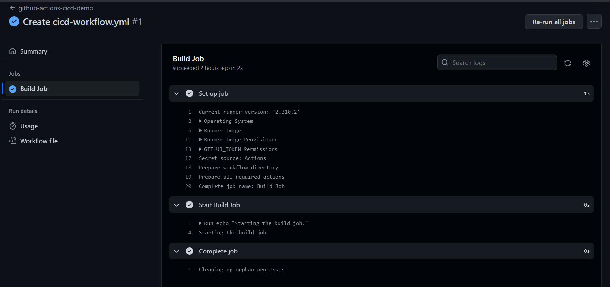

## Introduction to Micronaut and Github Actions CICD
[](https://github.com/Michle99/micronaut_cicd/actions/workflows/cicd-workflow.yml)

## Description
Create a simple micronaut project and github actions workflow.

## Getting Started
Create a Micronaut poject using the Micronaut Launch tool to generate your project:
[Micronaut Launch tool](https://micronaut.io/launch)

## Create Github Actions
To create a github action:
- Create a new repository for the sample micronaut project.
- Go to the `actions` of the repository, click on the `set up a workflow yourself ->` link below the `Get started with Github Actions` header.
- A new tab opens with a `.github/workflows/main.yml`, you can rename the `.yml`.
- Enter the below script to create a github action:
```
name: github-actions-cicd-demo
on:
  push:
    branches:
      - '*'
jobs:
  build-job:
    name: Build Job
    runs-on: ubuntu-latest
    steps:
      - name: 'Start Build Job'
        run: |
          echo "Starting the build job."

```
- Add and commit the sample project to the repository using git commands:

```
$ git add . && git commit -m "Initial Commit" && git push -u origin main
```
## Result 
The below screenshot is the result of creating the Github Actions:



## Resources
- [User Guide](https://docs.micronaut.io/4.1.5/guide/index.html)
- [API Reference](https://docs.micronaut.io/4.1.5/api/index.html)
- [Configuration Reference](https://docs.micronaut.io/4.1.5/guide/configurationreference.html)
- [Micronaut Guides](https://guides.micronaut.io/index.html)
---

- [Shadow Gradle Plugin](https://plugins.gradle.org/plugin/com.github.johnrengelman.shadow)
- [Micronaut Gradle Plugin documentation](https://micronaut-projects.github.io/micronaut-gradle-plugin/latest/)
- [GraalVM Gradle Plugin documentation](https://graalvm.github.io/native-build-tools/latest/gradle-plugin.html)
#### Feature serialization-jackson documentation

- [Micronaut Serialization Jackson Core documentation](https://micronaut-projects.github.io/micronaut-serialization/latest/guide/)


#### Feature micronaut-aot documentation

- [Micronaut AOT documentation](https://micronaut-projects.github.io/micronaut-aot/latest/guide/)


